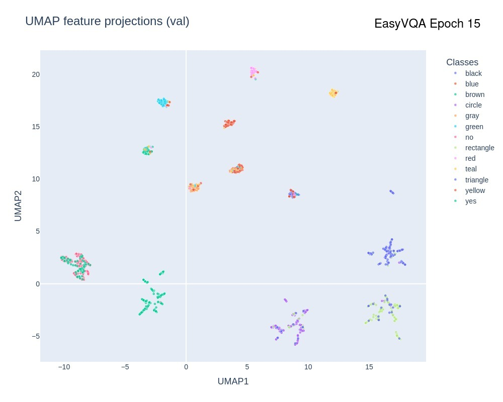
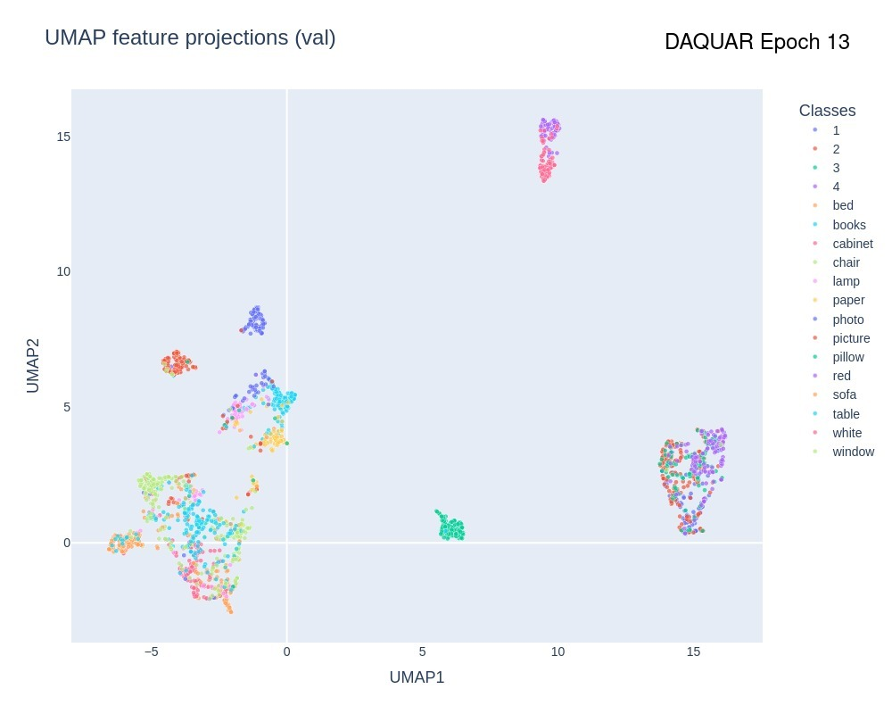

# BLIP-2: Using generative models on classification tasks

This repository demonstrates a technique for training the BLIP-2 generative model for classification tasks.

## Results

More training/evaluation metrics can be found in [this report](https://api.wandb.ai/links/razfv07-university-of-bologna/t3nwpt47) on wandb.

Prior to running the following files, please set up the environment first. The following python notebooks are available to demonstrate key operations:

- [preprocessing_easyvqa.ipynb](preprocessing_easyvqa.ipynb): reproduce the results related to pre-processing the EasyVQA dataset.
- [preprocessing_daquar.ipynb](preprocessing_daquar.ipynb): reproduce the results related to pre-processing the Daquar dataset.
- [results_easyvqa.ipynb](results_easyvqa.ipynb): reproduce the results after fine-tuning the model for the EasyVQA dataset.
- [results_daquar.ipynb](results_daquar.ipynb): reproduce the results after fine-tuning the model for the Daquar dataset.

| Video 1: EasyVQA Convergence | Video 2: DAQUAR Convergence |
|---------|---------|
| [](https://github.com/user-attachments/assets/b8147d5c-2ee8-4c3e-a763-2b6466b7e13a) | [](https://github.com/user-attachments/assets/49c084e5-82fc-41d5-a6e1-021870b1c175) |

## Set up the environment

Required dependencies:

- Anaconda (Check [here](https://docs.anaconda.com/anaconda/install/) for installation instructions)
- Python 3.12

```shell
> git clone https://github.com/atomwalk12/VisualQA.git
> cd visual-qa
> conda env create -f environment.yml
```

### Datasets

- `EasyVQA`: ready to use since the `easy-vqa` library automatically downloads the images when running the experiment.
- `DAQUAR`: needs to be downloaded manually. Download [these files](https://drive.google.com/file/d/1s0mpEdyAYkYGsFabzuxHxnSh33UbgJnx/view?usp=sharing) and place them under `<project-root>/data/daquar/dataset`. This is the recommended approach, otherwise use [this alternative](https://www.kaggle.com/datasets/bhavikardeshna/visual-question-answering-computer-vision-nlp/data).

### Models

If you would like to test the accumulated embeddings and to reproduce the diagrams under Results, follow approach 1. Otherwise, if you'd like to check only the fine-tuned models follow approach 2.

#### Approach 1: with visualisation embeddings

If the folders specified below don't exist, create them.

- `EasyVQA`: Download [from here](https://drive.google.com/file/d/1Q49mX9vQdTuoAPW_S_XngR3WDzjQKyTY/view?usp=sharing) and place them under: `<project-root>/data/models/easy_vqa/classifier/`. Then you will be able to reproduce all diagrams included in `results_easyvqa.ipynb`.
- `DAQUAR`: Download [from here](https://drive.google.com/file/d/1_4NSqVtuIpowuUY7ZIpEqWG26nztr_23/view?usp=sharing) and place them under: `<project-root>/data/models/daquar/classifier/`. Similarly, it should now be possible to reproduce all results included in `results_daquar.ipynb`.

#### Approach 2: using Hugginface (without embeddings)

Check the [EasyVQA](https://huggingface.co/atomwalk12/blip2-easyvqa-classifier)  and [DAQUAR](https://huggingface.co/atomwalk12/blip2-daquar-classifier) fine-tuned models at the Huggingface repositories. 

## Training/Evaluation scripts

### Training from scratch

```shell
# Fine-tune the classifiers.
> python finetune.py --model blip2-classifier --dataset easy-vqa --train-split 'train' --val-split 'val'
> python finetune.py --model blip2-classifier --dataset daquar --train-split 'train' --val-split 'val'

# Fine-tune the generative baselines.
> python finetune.py --model blip2-generator --dataset easy-vqa --train-split 'train' --val-split 'val'
> python finetune.py --model blip2-generator --dataset daquar --train-split 'train' --val-split 'val'

# Test the classifiers. Due to limited examples, no separate test dataset was used for daquar.
> python test.py --model blip2-classifier --dataset easy-vqa --test-split 'test'
> python test.py --model blip2-classifier --dataset daquar --test-split 'val' 

# Test the generative baselines.
> python test.py --model blip2-generator --dataset easy-vqa --test-split 'test'
> python test.py --model blip2-generator --dataset daquar --test-split 'val'     # Same as above.
```


